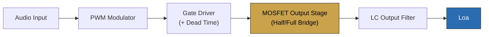
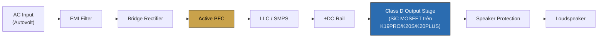

# Class D Amplifier — Tài liệu kỹ thuật & Phân tích ứng dụng KORAH

> **Nguồn:** tổng hợp từ bộ tài liệu `CLASS_D_Overview`, `Working_Principle`, `Hardware_Design`, `Performance`, `Applications`, `Leading_Manufacturers`, `References` — tài liệu ngành (Texas Instruments, Analog Devices, Infineon, AES Papers/Patents) và phân tích thị trường ngành pro-audio.
> **Đối chiếu dữ liệu KORAH:** `data/products.js` (bản chính thức, đã duyệt).
> **Nguồn kho tri thức chatbot tương ứng:** `data/knowledge/classd.js`.
>
> **Nguyên tắc biên tập:** Đây là kiến thức NGÀNH Class D nói chung (đa hãng, đa tầng cung ứng công nghệ). KORAH xác nhận dùng Class D trên toàn bộ K-Series và SiC MOSFET EliteSiC™ Onsemi trên K19PRO/K20S/K20PLUS. **KHÔNG suy diễn** topology mạch cụ thể, loại vòng điều khiển, tần số chuyển mạch, hay IC/module hãng nào KORAH đang dùng — KORAH tự thiết kế mạch khuếch đại hoàn chỉnh (Tầng 3 của ngành, xem mục 6), không phải module OEM mua sẵn.

---

## Mục lục

1. [Tổng quan khái niệm](#1-tổng-quan-khái-niệm)
2. [Bảng thông số kỹ thuật — Class D trên K-Series KORAH](#2-bảng-thông-số-kỹ-thuật--class-d-trên-k-series-korah)
3. [Bảng so sánh Class D vs Class AB/H](#3-bảng-so-sánh-class-d-vs-class-abh)
4. [Bảng so sánh 3 tầng cung ứng công nghệ ngành Class D](#4-bảng-so-sánh-3-tầng-cung-ứng-công-nghệ-ngành-class-d)
5. [Sơ đồ khối nguyên lý Class D (Mermaid)](#5-sơ-đồ-khối-nguyên-lý-class-d-mermaid)
6. [Sơ đồ kiến trúc hệ thống SMPS + Class D (Mermaid)](#6-sơ-đồ-kiến-trúc-hệ-thống-smps--class-d-mermaid)
7. [Sơ đồ khối nguyên lý Class D (ASCII)](#7-sơ-đồ-khối-nguyên-lý-class-d-ascii)
8. [Sơ đồ dạng sóng PWM (ASCII)](#8-sơ-đồ-dạng-sóng-pwm-ascii)
9. [Phân tích & tổng hợp](#9-phân-tích--tổng-hợp)
10. [Nguồn tham khảo](#10-nguồn-tham-khảo)

---

## 1. Tổng quan khái niệm

**Class D** là kiến trúc khuếch đại công suất hoạt động theo nguyên lý đóng cắt (switching), dùng MOSFET và điều chế độ rộng xung (PWM — Pulse Width Modulation) thay vì khuếch đại tuyến tính liên tục như Class AB/Class H. MOSFET chỉ hoạt động ở 2 trạng thái ON (dẫn hoàn toàn) / OFF (ngắt hoàn toàn), giúp giảm đồng thời tổn hao dẫn và tổn hao chuyển mạch.

**4 khối phần cứng chính:** PWM Controller → Gate Driver → MOSFET Output Stage (Half/Full Bridge) → LC Output Filter → Loa.

**Kết quả:** hiệu suất thường >90%, tỏa nhiệt thấp, kích thước/trọng lượng nhỏ mà vẫn đạt công suất lớn — đây là lý do Class D là công nghệ chủ đạo trong pro-audio hiện đại và toàn bộ K-Series KORAH đều dùng công nghệ này.

---

## 2. Bảng thông số kỹ thuật — Class D trên K-Series KORAH

*Nguồn: `data/products.js` — chỉ liệt kê dữ liệu đã công bố chính thức.*

| Model | Kênh | Class | Damping Factor | Bán dẫn tầng công suất |
|---|:---:|:---:|---|---|
| K16S | 2 | D | Chưa công bố | Silicon |
| K16PRO | 4 | D | >450 @8Ω, 20Hz–200Hz | Silicon |
| K19S | 2 | D | >2000 @8Ω, 20Hz–200Hz | Silicon |
| K19PRO | 4 | D | >500 @8Ω, 20Hz–200Hz | **SiC EliteSiC™ (Onsemi)** |
| K20S | 2 | D | >2000 @8Ω, 20Hz–200Hz | **SiC EliteSiC™ (Onsemi)** |
| K20PLUS | 4 | D | >800 @8Ω, 20Hz–200Hz | **SiC EliteSiC™ (Onsemi)** |

> Model discontinued K18S/K18PLUS dùng **Class TD** (khác Class D) — không thuộc phạm vi tài liệu này.

---

## 3. Bảng so sánh Class D vs Class AB/H

| Tiêu chí | Class AB / Class H | Class D |
|---|---|---|
| Nguyên lý | Khuếch đại tuyến tính liên tục | Đóng cắt (switching) + PWM |
| Trạng thái transistor | Dẫn một phần liên tục (tuyến tính) | Chỉ ON/OFF hoàn toàn |
| Hiệu suất | Thấp – trung bình (thường 50–70%) | Cao (thường >90%) |
| Tỏa nhiệt | Cao | Thấp |
| Kích thước / trọng lượng | Lớn, nặng (tản nhiệt lớn, biến áp tuyến tính) | Nhỏ, nhẹ |
| Độ méo (THD) tự nhiên | Thường thấp hơn khi thiết kế tốt | Phụ thuộc thiết kế PWM/LC Filter/Feedback — có thể đạt thấp tương đương với thiết kế tối ưu |
| EMI | Thấp | Cao hơn, cần lọc EMI kỹ |
| Phù hợp | Ứng dụng công suất vừa-nhỏ, ưu tiên độ trung thực tối đa | Công suất lớn, cần hiệu suất và gọn nhẹ — pro-audio hiện đại |
| **KORAH áp dụng** | Không | **Có** — toàn bộ K-Series |

---

## 4. Bảng so sánh 3 tầng cung ứng công nghệ ngành Class D

| Tiêu chí | Tầng 1 (Module OEM) | Tầng 2 (Chip nền tảng) | Tầng 3 (Pro-audio hoàn chỉnh, gồm KORAH) |
|---|---|---|---|
| Đối tượng khách hàng | Hãng Hi-Fi tích hợp vào sản phẩm | Hãng thiết kế amplifier (cả Tầng 1 và Tầng 3) | Người dùng cuối / đại lý phân phối |
| Trọng tâm kỹ thuật | Độ trung thực âm thanh cực cao (THD+N) | Hiệu suất chuyển mạch, độ bền linh kiện | Độ ổn định, công suất lớn, vận hành liên tục nhiều giờ |
| Ví dụ hãng | ICEpower, Hypex, Pascal Audio, Purifi Audio | Infineon MERUS™, Texas Instruments, Analog Devices, onsemi | Powersoft, Lab.gruppen, Crown, QSC, **KORAH** |
| Vị trí KORAH | — | Dùng linh kiện (SiC MOSFET Onsemi) | **KORAH thuộc tầng này** |

---

## 5. Sơ đồ khối nguyên lý Class D (Mermaid)



---

## 6. Sơ đồ kiến trúc hệ thống SMPS + Class D (Mermaid)



---

## 7. Sơ đồ khối nguyên lý Class D (ASCII)

```
 Audio Input
      │
      ▼
┌─────────────┐
│ PWM Modulator │   Biên độ lớn → xung rộng
└──────┬──────┘   Biên độ nhỏ  → xung hẹp
       │
       ▼
┌─────────────┐
│  Gate Driver  │   Tạo Dead Time — tránh Shoot-through
└──────┬──────┘
       │
       ▼
┌───────────────────┐
│  MOSFET Output Stage │   Half Bridge / Full Bridge
│    (chỉ ON hoặc OFF)  │   → hiệu suất cao, tổn hao thấp
└─────────┬─────────┘
          │
          ▼
┌─────────────────┐
│  LC Output Filter  │   Lọc bỏ tần số chuyển mạch cao
└─────────┬─────────┘   (250kHz–1.5MHz), khôi phục analog
          │
          ▼
      ┌───────┐
      │  Loa   │
      └───────┘
```

---

## 8. Sơ đồ dạng sóng PWM (ASCII)

```
Tín hiệu Audio gốc (analog, biên độ thay đổi theo thời gian):

  +A ┤        ╭─╮
     │      ╭─╯ ╰─╮
   0 ┤────╭─╯     ╰─╮────────────
     │  ╭─╯          ╰─╮
  -A ┤╭─╯               ╰─╮
     └──────────────────────────▶ t

Tín hiệu PWM tương ứng (độ rộng xung ∝ biên độ):

     ┌─┐ ┌───┐ ┌─────┐ ┌───┐ ┌─┐
   1 ┤ │ │   │ │     │ │   │ │ │
     │ │ │   │ │     │ │   │ │ │
   0 ┴─┘─┴───┴─┴─────┴─┴───┴─┴─┴──▶ t
     hẹp  rộng  rộng nhất  rộng  hẹp
    (biên độ nhỏ)  (biên độ đỉnh)  (biên độ nhỏ)

Sau LC Filter: loại bỏ tần số chuyển mạch, chỉ giữ lại
đường bao (envelope) trùng với tín hiệu audio gốc.
```

---

## 9. Phân tích & tổng hợp

### 9.1 Vì sao Class D là lựa chọn tất yếu cho pro-audio công suất lớn

Ưu điểm cốt lõi của Class D (hiệu suất >90%, tỏa nhiệt thấp, kích thước nhỏ) giải quyết trực tiếp 3 bài toán lớn của amplifier sự kiện/lắp đặt: (1) trọng lượng — quan trọng với đơn vị cho thuê/touring cần vận chuyển thường xuyên; (2) tản nhiệt — tỏa nhiệt thấp giảm yêu cầu quạt/tản nhiệt lớn, giúp máy gọn hơn; (3) chi phí vận hành điện năng — hiệu suất cao trực tiếp giảm hao phí điện khi chạy công suất lớn liên tục nhiều giờ. Đây là lý do toàn bộ K-Series KORAH đều dùng Class D thay vì Class AB/H.

### 9.2 Liên hệ Class D ↔ PFC ↔ SiC — 3 công nghệ cùng 1 hệ thống

Đối chiếu chuỗi mạch ở mục 6 với 2 tài liệu kỹ thuật liên quan (`pfc-active-pfc-technical-analysis.md`, `sic-technology-technical-analysis.md`): 3 công nghệ Class D, Active PFC và SiC MOSFET không độc lập mà **bổ trợ trực tiếp cho nhau** trong cùng 1 hệ thống nguồn-khuếch đại:
- PFC ổn định và mở rộng dải điện áp đầu vào (Autovolt).
- SiC MOSFET giảm tổn hao chuyển mạch, chịu nhiệt tốt — dùng ở cả tầng PFC lẫn tầng Class D.
- Class D khuếch đại công suất hiệu suất cao ở tầng cuối.

Đúng theo dữ liệu `products.js`: 3 model dùng SiC (K19PRO, K20S, K20PLUS) cũng là 3 model có PFC nâng cao nhất — xác nhận đây là chiến lược thiết kế nhất quán, không phải trùng hợp.

### 9.3 Vị trí KORAH trong chuỗi cung ứng công nghệ ngành

KORAH thuộc **Tầng 3** (thương hiệu pro-audio hoàn chỉnh, tự thiết kế mạch) — cùng nhóm với Powersoft, Lab.gruppen, Crown, QSC về mặt vị trí chuỗi cung ứng, dù khác nhau về quy mô và định vị thị trường. KORAH dùng linh kiện công suất (SiC MOSFET Onsemi) từ Tầng 2 — mô hình phổ biến của các thương hiệu pro-audio tự phát triển topology riêng thay vì mua module hoàn chỉnh từ Tầng 1.

### 9.4 Damping Factor — điểm khác biệt kỹ thuật đáng chú ý giữa các model

Theo Bảng 2, K19S và K20S đạt Damping Factor >2000 @8Ω — cao vượt trội so với K16PRO (>450) và K19PRO (>500). Damping Factor cao đồng nghĩa khả năng kiểm soát màng loa tốt hơn, đặc biệt quan trọng cho ứng dụng sub bass — phù hợp với định vị sản phẩm 2 kênh (K16S/K19S/K20S) ưu tiên ghép loa sub như đã phân tích trong `data/knowledge/phoi-ghep-loa.js`.

### 9.5 Giới hạn cần lưu ý khi truyền thông

- KHÔNG khẳng định topology mạch cụ thể (loại vòng điều khiển: self-oscillating hay điều khiển số, tần số chuyển mạch chính xác) nếu tài liệu chính thức KORAH chưa công bố.
- KHÔNG khẳng định KORAH dùng IC/module Class D của bất kỳ hãng Tầng 1/Tầng 2 nào (ICEpower, Hypex, Infineon MERUS, TI...) ngoài SiC MOSFET Onsemi đã xác nhận — KORAH tự thiết kế mạch, không phải OEM.
- Khi so sánh với đối thủ: phân biệt rõ "module OEM" (Tầng 1) và "sản phẩm hoàn chỉnh" (Tầng 3) — đây là 2 loại sản phẩm khác bản chất dù cùng dùng công nghệ Class D, tránh so sánh nhầm lẫn.

---

## 10. Nguồn tham khảo

- `01_CLASS_D_Overview.md`, `02_CLASS_D_Working_Principle.md`, `03_CLASS_D_Hardware_Design.md`, `04_CLASS_D_Performance.md`, `05_CLASS_D_Applications.md`, `06_CLASS_D_Leading_Manufacturers.md`, `07_CLASS_D_References.md`.
- Texas Instruments — Class-D Audio Amplifier Design, "Filter Free Class-D Amplifiers" (SNAA034A).
- Analog Devices — "Class D Amplifiers: Fundamentals of Operation and Recent Developments".
- Infineon — MERUS™ Class D Audio Solutions.
- AES Convention Papers (Bruno Putzeys, self-oscillating Class D — chỉ tóm tắt công khai, không sao chép nội dung có bản quyền).
- Dữ liệu chính thức KORAH: `data/products.js` (đã duyệt).

*Tổng hợp và diễn giải lại bằng tiếng Việt cho mục đích nội bộ KORAH — không sao chép nguyên văn từ nguồn.*
