# Active PFC trong Power Amplifier — Tài liệu kỹ thuật & Phân tích ứng dụng KORAH

> **Nguồn:** tổng hợp từ tài liệu ngành (bài báo kỹ thuật, patent, tiêu chuẩn IEC, tài liệu ứng dụng hãng bán dẫn: Monolithic Power Systems, EDN, EE Power, Infineon, Ametherm, TDK) và bài viết kỹ thuật ngành pro-audio (LEA Professional, Carvin Audio, NuPrime Audio).
> **Đối chiếu dữ liệu KORAH:** `data/products.js` (bản chính thức, đã duyệt).
> **Nguồn kho tri thức chatbot tương ứng:** `data/knowledge/pfc.js`, `data/knowledge/sic.js`.
>
> **Nguyên tắc biên tập:** Đây là kiến thức NGÀNH nói chung (áp dụng cho mọi power supply có PFC), KHÔNG phải thông số nội bộ mạch PFC của KORAH. Mọi khẳng định về thiết kế KORAH đều đối chiếu với `data/products.js`; KHÔNG suy diễn topology (Boost cổ điển/Interleaved/Totem-pole) hay chế độ dẫn dòng (CCM/DCM/CrCM) cụ thể mà KORAH đang dùng nếu tài liệu chính thức chưa công bố.

---

## Mục lục

1. [Tổng quan khái niệm](#1-tổng-quan-khái-niệm)
2. [Bảng thông số kỹ thuật — PFC trên K-Series KORAH](#2-bảng-thông-số-kỹ-thuật--pfc-trên-k-series-korah)
3. [Bảng so sánh Passive PFC vs Active PFC](#3-bảng-so-sánh-passive-pfc-vs-active-pfc)
4. [Bảng so sánh 3 chế độ dẫn dòng (CCM / DCM / BCM)](#4-bảng-so-sánh-3-chế-độ-dẫn-dòng-ccm--dcm--bcm)
5. [Sơ đồ khối mạch nguồn (Mermaid)](#5-sơ-đồ-khối-mạch-nguồn-mermaid)
6. [Sơ đồ khối mạch nguồn (ASCII)](#6-sơ-đồ-khối-mạch-nguồn-ascii)
7. [Sơ đồ nguyên lý Boost PFC (ASCII)](#7-sơ-đồ-nguyên-lý-boost-pfc-ascii)
8. [Phân tích & tổng hợp](#8-phân-tích--tổng-hợp)
9. [Nguồn tham khảo](#9-nguồn-tham-khảo)

---

## 1. Tổng quan khái niệm

**Power Factor (PF)** là tỷ số giữa công suất thực (Watt) và công suất biểu kiến (Volt-Ampe). Bộ nguồn không PFC hút dòng dạng xung nhọn quanh đỉnh sóng sin (nạp tụ lọc qua cầu diode) — PF thực tế chỉ ~0.5–0.6, sinh hài dòng điện (harmonics) lan vào lưới điện.

**Active PFC** dùng mạch chuyển mạch tần số cao (thường Boost Converter) với vòng điều khiển buộc dòng điện ngõ vào bám theo điện áp vào — đạt PF 0.95–0.99, đồng thời cho phép dải điện áp vào rộng (Autovolt/Universal Input).

Với power amplifier Class D công suất lớn, PFC còn giải quyết đặc thù riêng: **tải xung theo tín hiệu âm nhạc** (công suất tức thời nhảy vọt ở tiếng bass) — đòi hỏi đáp ứng động nhanh, bulk capacitor đủ lớn và linh kiện chuyển mạch tổn hao thấp (SiC MOSFET).

---

## 2. Bảng thông số kỹ thuật — PFC trên K-Series KORAH

*Nguồn: `data/products.js` — chỉ liệt kê dữ liệu đã công bố chính thức.*

| Model | Kênh | Bộ nguồn (theo specs) | Dải điện áp | Bán dẫn tầng công suất |
|---|:---:|---|---|---|
| K16S | 2 | PFC (Power Factor Correction) — ổn định điện áp đầu vào | Chưa công bố dải cụ thể | Silicon (Class D) |
| K16PRO | 4 | Active PFC — dải điện áp hiệu quả 140V–270V | 140V – 270V | Silicon (Class D) |
| K19S | 2 | PFC — hoạt động ổn định AC 140V–240V | AC 140V – 240V | Silicon (Class D) |
| K19PRO | 4 | PFC Autovolt — dải điện áp hiệu quả 140V–270V | 140V – 270V | **SiC EliteSiC™ (Onsemi)** |
| K20S | 2 | PFC (Power Factor Correction) — ổn định điện áp, tối ưu hiệu suất | Chưa công bố dải cụ thể | **SiC EliteSiC™ (Onsemi)** |
| K20PLUS | 4 | PFC (Power Factor Correction) — ổn định điện áp, tối ưu hiệu suất | Chưa công bố dải cụ thể | **SiC EliteSiC™ (Onsemi)** |

> Các ô "Chưa công bố dải cụ thể" — không suy diễn số liệu; cần đối chiếu datasheet gốc nếu cần xác nhận thêm.

---

## 3. Bảng so sánh Passive PFC vs Active PFC

| Tiêu chí | Passive PFC | Active PFC |
|---|---|---|
| Nguyên lý | Cuộn cảm lớn nối tiếp ngõ vào, làm mượt dòng điện | Mạch chuyển mạch tần số cao (Boost Converter) + vòng điều khiển bám dòng theo điện áp vào |
| Power Factor đạt được | ~0.7 – 0.8 | ~0.95 – 0.99 |
| Chi phí linh kiện | Thấp | Cao hơn |
| Kích thước | Cồng kềnh (cuộn cảm lớn) | Gọn hơn (biến áp/cuộn cảm nhỏ hơn nhờ tần số chuyển mạch cao) |
| Dải điện áp vào | Cố định/hẹp | Rộng (Autovolt / Universal Input) |
| Đáp ứng tiêu chuẩn hài dòng (IEC 61000-3-2) | Hạn chế ở công suất lớn | Đáp ứng tốt ở mọi mức công suất |
| Phù hợp công suất | Thấp – trung bình | Trung bình – cao (khuyến nghị cho pro-audio công suất lớn) |
| Nhiễu EMI | Thấp | Cao hơn, cần lọc EMI kỹ |
| **KORAH áp dụng** | Không | **Có** — toàn bộ K-Series |

---

## 4. Bảng so sánh 3 chế độ dẫn dòng (CCM / DCM / BCM)

| Chế độ | Dòng điện qua cuộn cảm | Gợn dòng / THDi | Tổn hao chuyển mạch | Phù hợp |
|---|---|---|---|---|
| **CCM** (Continuous) | Không về 0 giữa các chu kỳ | Thấp | Cao hơn (dòng khác 0 khi chuyển mạch) | Công suất lớn |
| **DCM** (Discontinuous) | Về 0 hoàn toàn giữa các chu kỳ | Cao hơn (dòng đỉnh lớn) | Thấp | Công suất thấp |
| **BCM/CrCM** (Boundary/Critical) | Chạm 0 rồi chuyển mạch ngay | Trung gian | Trung gian | Cân bằng 2 chế độ trên |

> Ở công suất lớn (pro-audio), CCM thường được ưu tiên vì THDi thấp — đây là lý do các thiết kế PFC công suất lớn có xu hướng dùng MOSFET SiC (chịu nhiệt, tổn hao chuyển mạch thấp) thay vì Silicon thường. **Lưu ý:** KORAH chưa công bố chế độ dẫn dòng cụ thể đang dùng — bảng này chỉ là kiến thức ngành tham chiếu.

---

## 5. Sơ đồ khối mạch nguồn (Mermaid)

```mermaid
flowchart LR
    AC["Nguồn AC vào<br/>(Autovolt: 140V–270V)"] --> EMI["Lọc EMI"]
    EMI --> BR["Cầu chỉnh lưu<br/>(Bridge Rectifier)"]
    BR --> NTC["NTC Thermistor<br/>(kiểm soát Inrush Current)"]
    NTC --> PFC["Active PFC<br/>(Boost Converter)"]
    PFC --> BULK["Bulk Capacitor<br/>(dự trữ năng lượng / Hold-up Time)"]
    BULK --> DCBUS["DC Bus điện áp cao"]
    DCBUS --> AMP["Tầng khuếch đại Class D<br/>(SiC MOSFET trên K19PRO/K20S/K20PLUS)"]
    AMP --> SPK["Ngõ ra loa (Speakon)"]

    style PFC fill:#c9a24b,stroke:#333,color:#000
    style AMP fill:#2b6cb0,stroke:#333,color:#fff
```



---

## 6. Sơ đồ khối mạch nguồn (ASCII)

```
 AC Input          EMI Filter        Bridge Rect.        NTC (Inrush)
┌──────────┐      ┌──────────┐      ┌──────────┐      ┌──────────┐
│ 140–270V │ ───▶ │  Lọc EMI  │ ───▶ │  Chỉnh lưu │ ───▶ │  NTC     │
│ Autovolt │      │          │      │  cầu diode │      │  Thermistor│
└──────────┘      └──────────┘      └──────────┘      └────┬─────┘
                                                              │
                                                              ▼
┌──────────────────┐      ┌───────────────────┐      ┌──────────────┐
│  Active PFC        │ ───▶│  Bulk Capacitor     │ ───▶│  DC Bus       │
│  (Boost Converter)  │     │  (Hold-up Time)      │     │  điện áp cao  │
└──────────────────┘      └───────────────────┘      └──────┬───────┘
                                                               │
                                                               ▼
                                                    ┌────────────────────┐
                                                    │  Class D Amplifier   │
                                                    │  (SiC MOSFET trên      │
                                                    │   K19PRO/K20S/K20PLUS) │
                                                    └──────────┬─────────┘
                                                               │
                                                               ▼
                                                        ┌─────────────┐
                                                        │  Ngõ ra loa   │
                                                        │  (Speakon)    │
                                                        └─────────────┘
```

---

## 7. Sơ đồ nguyên lý Boost PFC (ASCII)

```
                    L (Cuộn cảm Boost)         D (Diode)
    Vin(rect) o───▶───UUUU───┬───────────▶|───────┬──── Vout (DC Bus)
                              │                     │
                              │                     │
                            ─────                 ─────
                            │ Q │ MOSFET           │ C │ Bulk Cap
                            │   │ (chuyển mạch)     │   │
                            ─────                 ─────
                              │                     │
    GND o──────────────────────────────────────────┴──── GND
                              ▲
                              │
                    ┌───────────────────┐
                    │  PFC Controller     │
                    │  (Average Current    │
                    │   Mode Control)       │
                    │  đo dòng qua L +      │
                    │  điện áp vào theo      │
                    │  thời gian thực        │
                    └───────────────────┘

Nguyên lý: Controller điều chỉnh duty cycle đóng/mở Q sao cho dòng
điện trung bình qua L luôn bám theo hình dạng + pha của điện áp vào
→ ngõ vào "giả lập" tải thuần trở trước lưới điện → PF ~0.95–0.99.
```

---

## 8. Phân tích & tổng hợp

### 8.1 Vì sao PFC quan trọng với power amplifier hơn các thiết bị điện tử khác

Power amplifier Class D công suất lớn có đặc thù **tải xung theo tín hiệu âm nhạc**: công suất tức thời dao động rất mạnh (gần như không tải → đỉnh công suất cực đại trong mili-giây khi có tiếng bass/kick drum). Đây là tải xung ở quy mô lớn hơn nhiều so với PSU máy tính hay đèn LED — nhóm ứng dụng mà phần lớn tài liệu PFC thương mại hướng tới. Vì vậy tầng PFC cho amplifier cần 3 yếu tố mà thiết kế PFC "thông thường" không nhất thiết tối ưu:

1. **Đáp ứng động nhanh** — bắt kịp thay đổi tải đột ngột do bass mà không làm méo dòng điện vào hay sụt áp bus DC.
2. **Bulk capacitor đủ lớn** — bù khoảng trễ giữa lúc tải tăng đột ngột và lúc vòng điều khiển PFC kịp phản ứng.
3. **Linh kiện chuyển mạch tổn hao thấp, chịu nhiệt tốt** — vì amplifier sự kiện chạy công suất cao liên tục nhiều giờ, khác PSU máy tính chạy tải tương đối ổn định.

### 8.2 Liên hệ PFC ↔ SiC trong thiết kế KORAH

Đối chiếu Bảng 2: 3 model dùng SiC MOSFET (K19PRO, K20S, K20PLUS) đều là các model PFC cao cấp nhất dòng — đúng với luận điểm ở mục 8.1: SiC MOSFET (tổn hao chuyển mạch thấp, chịu nhiệt đến 200–250°C) là lựa chọn phù hợp khi PFC cần vận hành ở chế độ công suất lớn, liên tục nhiều giờ. Đây là cơ sở hợp lý — không phải suy diễn — vì dữ liệu `tech: [...]` trong `products.js` xác nhận cả 2 công nghệ (`pfc`, `sic`) cùng xuất hiện trên đúng 3 model này.

### 8.3 Giá trị thực tế cho thị trường Việt Nam

Vì Active PFC hoạt động dựa trên điện áp đã chỉnh lưu (không phụ thuộc cứng vào 1 mức AC cố định), nó cho phép **Autovolt/Universal Input** mà không cần mạch chuyển tap thủ công. Với điện lưới không ổn định ở nhiều khu vực Việt Nam (đặc biệt vùng xa hoặc dùng máy phát điện cho sự kiện lưu động), đây là lợi ích thực tế lớn: giảm nhu cầu ổn áp ngoài rời, giảm rủi ro hư hỏng khi điện áp dao động, và — theo Bảng 2 — K16PRO/K19PRO công bố rõ dải hiệu quả 140V–270V, K19S công bố dải hoạt động AC 140V–240V.

### 8.4 Giới hạn cần lưu ý khi truyền thông

- KHÔNG khẳng định topology cụ thể (Boost cổ điển/Interleaved/Totem-pole) hay chế độ dẫn dòng (CCM/DCM/BCM) của KORAH — tài liệu chính thức chưa công bố.
- KHÔNG khẳng định tần số chuyển mạch, loại IC điều khiển PFC cụ thể.
- Khi viết nội dung khách hàng cuối: "dịch" thuật ngữ kỹ thuật (CCM, THDi, Totem-pole...) thành lợi ích thực tế — các thuật ngữ hàn lâm chỉ nên dùng trong tài liệu kỹ thuật chuyên sâu cho đại lý/kỹ thuật viên (đúng như tài liệu này).

---

## 9. Nguồn tham khảo

- Bài báo kỹ thuật & tài liệu ứng dụng: Monolithic Power Systems, EDN, EE Power, Infineon.
- Tiêu chuẩn IEC 61000-3-2 (tổng hợp Wikipedia + tài liệu hướng dẫn EPSMA).
- Tài liệu ứng dụng NTC thermistor: Ametherm, TDK.
- Bài viết kỹ thuật ngành pro-audio: LEA Professional, Carvin Audio, NuPrime Audio.
- Dữ liệu chính thức KORAH: `data/products.js` (đã duyệt).

*Tổng hợp và diễn giải lại bằng tiếng Việt cho mục đích nội bộ KORAH — không sao chép nguyên văn từ nguồn.*
