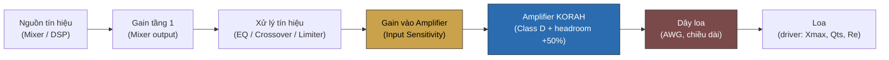

# Phối Ghép Loa – Amplifier Thực Tế — Tài liệu kỹ thuật & Phân tích ứng dụng KORAH

> **Nguồn:** tổng hợp từ tài liệu ngành pro-audio (AES2 standard, Rane Corporation Sound System Design Reference Manual, Crown Audio Amplifier Application Guide, Rational Acoustics, PerkAudio, Audioholics) và bộ tài liệu nội bộ Thiele/Small Parameters (`01–20_*.md`, tổng hợp từ MONACOR, Studio Six Digital, speakerwizard.co.uk).
> **Đối chiếu dữ liệu KORAH:** `data/products.js` (bản chính thức, đã duyệt).
> **Nguồn kho tri thức chatbot tương ứng:** `data/knowledge/phoi-ghep-loa.js`.
>
> **Nguyên tắc biên tập:** Đây là kiến thức NGÀNH nói chung (áp dụng cho mọi hệ thống loa + amplifier chuyên nghiệp), KHÔNG phải thông số nội bộ mạch khuếch đại của KORAH. Mọi con số công suất/trở kháng KORAH đều đối chiếu với `data/products.js`; công thức headroom (+50%, không giới hạn trần, không dùng tải 2Ω) là quy ước tư vấn nội bộ đã thống nhất, không phải chuẩn ngành bắt buộc duy nhất.

---

## Mục lục

1. [Tổng quan khái niệm](#1-tổng-quan-khái-niệm)
2. [Bảng thông số kỹ thuật — Headroom khuyến nghị theo từng model KORAH](#2-bảng-thông-số-kỹ-thuật--headroom-khuyến-nghị-theo-từng-model-korah)
3. [Bảng so sánh 3 mức công suất loa: RMS / Program / Peak](#3-bảng-so-sánh-3-mức-công-suất-loa-rms--program--peak)
4. [Bảng so sánh Damping Factor: Datasheet vs Thực tế tại loa](#4-bảng-so-sánh-damping-factor-datasheet-vs-thực-tế-tại-loa)
5. [Sơ đồ chuỗi Gain Structure (Mermaid)](#5-sơ-đồ-chuỗi-gain-structure-mermaid)
6. [Sơ đồ ảnh hưởng dây loa lên Damping Factor thực tế (ASCII)](#6-sơ-đồ-ảnh-hưởng-dây-loa-lên-damping-factor-thực-tế-ascii)
7. [Sơ đồ đường cong trở kháng loa theo tần số (ASCII)](#7-sơ-đồ-đường-cong-trở-kháng-loa-theo-tần-số-ascii)
8. [Phân tích & tổng hợp](#8-phân-tích--tổng-hợp)
9. [Nguồn tham khảo](#9-nguồn-tham-khảo)

---

## 1. Tổng quan khái niệm

**Gain Structure** là cách cân chỉnh mức tín hiệu (gain) qua từng tầng thiết bị trong dàn âm thanh (mixer → xử lý tín hiệu → amplifier) sao cho mỗi tầng hoạt động ở vùng tối ưu — đủ cao để không lẫn nhiễu nền (noise floor), đủ thấp để không clip. Gain Structure sai là nguyên nhân phổ biến gây méo tiếng hoặc ồn dù amplifier hoàn toàn bình thường — đây là lý do khi chẩn đoán sự cố âm thanh, cần xét toàn bộ chuỗi tín hiệu, không chỉ riêng amplifier.

**Crest Factor** là tỷ lệ (dB) giữa công suất đỉnh tức thời (Peak) và công suất trung bình liên tục (RMS) của tín hiệu. Nhạc thực tế có Crest Factor khoảng 12–20dB — đỉnh nhạc (kick drum, snare) có thể vượt xa mức trung bình trong khoảnh khắc rất ngắn. Đây là cơ sở kỹ thuật trực tiếp cho nguyên tắc **headroom +50%** đang áp dụng: amplifier cần dư công suất để tái tạo đúng các đỉnh nhạc mà không clip, dù công suất trung bình thực tế thấp hơn nhiều so với công suất đỉnh.

**Damping Factor** (DF) là tỷ số giữa trở kháng loa và trở kháng ngõ ra amplifier — DF càng cao, amplifier càng kiểm soát tốt chuyển động màng loa. Tuy nhiên DF là một trong những thông số dễ bị hiểu sai nhất trong tư vấn bán hàng: DF công bố trên datasheet chỉ đúng tại cực đấu dây amplifier, còn DF **thực tế tại loa** phụ thuộc thêm vào điện trở dây loa (AWG, chiều dài) — và trên một ngưỡng nhất định, DF cao hơn không còn tạo khác biệt nghe được.

---

## 2. Bảng thông số kỹ thuật — Headroom khuyến nghị theo từng model KORAH

*Nguồn: `data/products.js` (công suất 8Ω/4Ω đã công bố) + công thức headroom nội bộ (ampli ≥ 1.5× RMS loa, không giới hạn trần, không dùng tải 2Ω).*

| Model | Kênh | Công suất 8Ω/kênh | RMS loa tối đa khuyến nghị @8Ω | Công suất 4Ω/kênh | RMS loa tối đa khuyến nghị @4Ω | Loại loa ưu tiên |
|---|:---:|---|---|---|---|---|
| K16S | 2 | 1600W | ~1067W | 2800W | ~1867W | SUB |
| K16PRO | 4 | 1250W | ~833W | 2000W | ~1333W | FULL-RANGE |
| K19S | 2 | 2200W | ~1467W | 3400W | ~2267W | SUB |
| K19PRO | 4 | 1650W | ~1100W | 2450W | ~1633W | FULL-RANGE |
| K20S | 2 | 3000W | ~2000W | 4800W | ~3200W | SUB |
| K20PLUS | 4 | 1900W | ~1267W | 3000W | ~2000W | FULL-RANGE |

> "RMS loa tối đa khuyến nghị" = công suất amplifier ÷ 1.5 (headroom tối thiểu +50%, không có trần trên — loa công suất thấp hơn vẫn an toàn, dư headroom càng nhiều càng tốt khi chạy liên tục nhiều giờ).

---

## 3. Bảng so sánh 3 mức công suất loa: RMS / Program / Peak

| Mức | Định nghĩa | Hệ số so với RMS | Dùng để làm gì |
|---|---|:---:|---|
| **RMS (Continuous)** | Công suất trung bình loa chịu được liên tục, đo theo test nhiệt tiêu chuẩn (AES2: pink noise 2 giờ) | 1× (mức tham chiếu) | **Dùng để tính headroom ghép amplifier** — đây là con số duy nhất nên dùng khi tư vấn |
| **Program Power** | Ước tính công suất trung bình thực tế khi phát nhạc (không phải tín hiệu test đều) | ~2× (cao hơn 3dB) | Tham khảo, KHÔNG dùng để tính ghép ampli |
| **Peak Power** | Công suất đỉnh tức thời loa chịu được trong khoảnh khắc rất ngắn | ~4× hoặc hơn (tùy Crest Factor chuẩn đo: 6dB hoặc 12dB) | Thường bị nhầm là "công suất loa" trên nhãn marketing — dễ khiến khách chọn ampli quá nhỏ nếu nhầm với RMS |

> Chuẩn AES2-1984 dùng Crest Factor 6dB (đỉnh gấp 4 lần RMS); AES2-2012 dùng Crest Factor 12dB (phản ánh sát nhạc hiện đại hơn). Công suất AES2 luôn tính trên **Zmin** (trở kháng thấp nhất thực tế của loa), không phải trở kháng danh định.

---

## 4. Bảng so sánh Damping Factor: Datasheet vs Thực tế tại loa

| Yếu tố | Damping Factor tại cực đấu dây amplifier (Datasheet) | Damping Factor thực tế tại loa |
|---|---|---|
| Phụ thuộc vào | Trở kháng ngõ ra amplifier (thường rất thấp, DF datasheet có thể lên tới hàng trăm/nghìn) | Trở kháng ngõ ra amplifier **CỘNG** điện trở dây loa (phụ thuộc AWG + chiều dài) |
| Ý nghĩa marketing | Con số lớn thường được quảng cáo nổi bật | Không được công bố — phụ thuộc lắp đặt thực tế của từng công trình |
| Ngưỡng cải thiện thực nghe | Không giới hạn trên lý thuyết | **DF > 50 hầu như không còn cải thiện đáng kể chất lượng nghe được** — điện trở dây loa và mối nối trở thành yếu tố giới hạn chính |
| Ai kiểm soát được | KORAH (thiết kế mạch công suất) | Người lắp đặt (chọn tiết diện dây, rút ngắn khoảng cách) |

**Ví dụ minh họa ảnh hưởng dây loa (loa 8Ω, DF ampli tại cực đấu dây = 200):**

| Dây loa | Điện trở dây (khứ hồi, ước tính) | DF thực tế tại loa |
|---|---|---|
| AWG 16, 10m | ~0.08Ω | ~90 |
| AWG 14, 20m | ~0.10Ω | ~73 |
| AWG 12, 30m | ~0.10Ω | ~73 |
| AWG 18, 30m (dây quá nhỏ, quá dài) | ~0.40Ω | ~19 |

> Số liệu minh họa dựa trên công thức DF_thực_tế = Z_loa ÷ (Z_ra_ampli + R_dây) — dùng để minh họa xu hướng, không phải số đo thực nghiệm của KORAH.

---

## 5. Sơ đồ chuỗi Gain Structure (Mermaid)



> Mỗi mũi tên là 1 điểm có thể sai lệch gain (quá thấp → nhiễu nền; quá cao → clip). Amplifier chỉ là 1 mắt xích — sự cố "méo tiếng" cần xét toàn chuỗi, không chỉ riêng amplifier.

---

## 6. Sơ đồ ảnh hưởng dây loa lên Damping Factor thực tế (ASCII)

```
┌──────────────────┐        R_dây (AWG, chiều dài)        ┌──────────────┐
│  Amplifier KORAH   │──────────/\/\/\/\──────────────────▶│    Loa (Z)     │
│  Z_ra ≈ rất thấp    │                                      │              │
│  (DF datasheet cao) │◀─────────────────────────────────────│              │
└──────────────────┘                                      └──────────────┘

DF thực tế tại loa = Z_loa ÷ (Z_ra_ampli + R_dây)

  Dây to, ngắn (AWG12–14, <15m)  →  R_dây nhỏ  →  DF thực tế gần với datasheet
  Dây nhỏ, dài (AWG18+, >20m)    →  R_dây lớn  →  DF thực tế tụt xuống rõ rệt
                                                    (bass nghe "lỏng" hơn dù
                                                     ampli có DF datasheet cao)
```

---

## 7. Sơ đồ đường cong trở kháng loa theo tần số (ASCII)

```
 Trở kháng (Ω)
   │
   │           ▲ Đỉnh cộng hưởng Fs
   │          ╱ ╲  (có thể gấp 3–6 lần
   │         ╱   ╲   trở kháng danh định)
   │        ╱     ╲
   │       ╱       ╲___                              ╱── tăng dần
   │      ╱             ╲___  Zmin              _____╱    (ảnh hưởng Le
   │     ╱                   ╲________     _____╱          ở tần số cao)
   │────╱────────────────────────────╲───╱───────────────────────────▶
   │  "8Ω danh định" (đường tham chiếu, KHÔNG phải giá trị đo thực tế)
   └──────────────────────────────────────────────────────────  Tần số (Hz)
        Fs (~20-100Hz)         Zmin (điểm ampli phải "chịu" nặng nhất)

Ghi chú: "8Ω"/"4Ω" ghi trên loa là trở kháng DANH ĐỊNH (quy ước phân loại),
không phải giá trị đo được tại mọi tần số. Chuẩn AES2 tính công suất chịu
tải dựa trên Zmin — điểm thấp nhất thực tế trên đường cong này.
```

---

## 8. Phân tích & tổng hợp

### 8.1 Vì sao Crest Factor là cơ sở kỹ thuật cho nguyên tắc headroom +50%

Nguyên tắc "ampli lớn hơn RMS loa tối thiểu 50%" đang áp dụng cho K-Series không phải con số tùy ý — nó phản ánh thực tế Crest Factor 12–20dB của nhạc hiện đại: nếu chọn ampli đúng bằng RMS loa, amplifier sẽ clip liên tục ở mọi đỉnh nhạc (kick drum, snare), tạo sóng vuông gây méo tiếng và tăng nguy cơ hỏng loa (đặc biệt tweeter) — nguy hiểm cho loa hơn nhiều so với bản thân công suất lớn dư headroom. Dư headroom +50% giúp amplifier tái tạo đúng các đỉnh nhạc trong vùng tuyến tính, không chạm giới hạn clip.

### 8.2 Damping Factor: giới hạn thực tế và vai trò của người lắp đặt

Bảng 4 cho thấy 2 điều quan trọng khi tư vấn: (1) DF trên 50 hầu như không tạo khác biệt nghe được — nên không cần quá đề cao con số DF hàng nghìn trên datasheet marketing; (2) yếu tố quyết định DF thực tế tại loa trong đa số hệ thống lắp đặt thực tế lại là **dây loa**, không phải bản thân amplifier. Đây là điểm KORAH kiểm soát được (thiết kế mạch công suất trở kháng ra thấp) nhưng **không kiểm soát được khâu lắp đặt** — cần tư vấn rõ cho khách hàng/đại lý về việc chọn tiết diện dây phù hợp khoảng cách, đặc biệt với hệ thống công suất lớn hoặc dây chạy xa (sự kiện ngoài trời, lắp đặt cố định hội trường).

### 8.3 Phân biệt RMS/Program/Peak — giảm rủi ro tư vấn sai vì nhãn công suất mập mờ

Không phải nhà sản xuất loa nào cũng công bố công suất theo đúng chuẩn AES2 — nhiều loa dùng nhãn mập mờ ("Music Power", "Max Power") mà không rõ đang chỉ RMS, Program hay Peak. Nếu tư vấn viên nhầm lẫn dùng số Peak (cao gấp ~4 lần RMS) để tính headroom, kết quả sẽ chọn ampli quá nhỏ so với nhu cầu thực tế — ngược lại hoàn toàn với mục đích của nguyên tắc headroom. Khi khách hàng không chắc chắn con số công bố là loại nào, nên áp dụng thêm hệ số an toàn (coi là Peak/Max) thay vì tin tuyệt đối vào nhãn.

### 8.4 Trở kháng danh định vs thực tế — vì sao không nên chạy sát giới hạn công suất

Mục 7 cho thấy trở kháng loa dao động mạnh theo tần số, không phải hằng số. Zmin (điểm thấp nhất) mới là giá trị amplifier thực sự phải "chịu" — đây là lý do chuẩn AES2 dùng Zmin để tính công suất chịu tải, và cũng là lý do khuyến cáo "không dùng tải 2Ω" của KORAH mang tính an toàn kép: vừa tránh tải danh định quá thấp, vừa tránh trường hợp Zmin thực tế của loa còn thấp hơn nữa khi cộng dồn hiệu ứng trở kháng theo tần số.

### 8.5 Ranh giới trách nhiệm khi chẩn đoán sự cố

Khi khách phản ánh sự cố âm thanh, cần phân biệt rõ nguyên nhân đến từ amplifier hay từ loa/lắp đặt trước khi kết luận:

| Hiện tượng khách phản ánh | Nguyên nhân thường gặp | Thuộc về |
|---|---|---|
| Rè/méo dù ampli chưa hết công suất | Vượt Xmax cơ học của driver (bass sâu, âm lượng lớn, không có high-pass filter) | Loa |
| Bass ù, thiếu kiểm soát dù DF ampli cao | Thùng loa không hợp driver, HOẶC dây loa quá nhỏ/dài làm giảm DF thực tế | Loa hoặc lắp đặt |
| Âm lượng giảm dần sau khi chạy lâu | Power Compression (Re cuộn dây loa tăng theo nhiệt) | Loa (hiện tượng vật lý bình thường) |
| 2 loa cùng RMS, cùng Ω nhưng nghe khác | Khác BL/Mms/Qts/độ nhạy thực tế của driver | Loa |

> Chi tiết cơ chế vật lý của từng hiện tượng (Xmax, Qts, Power Compression, BL/Mms) — xem bộ tài liệu nội bộ `01–20_*.md` (Thiele/Small Parameters).

---

## 9. Nguồn tham khảo

- Chuẩn đo: AES2-1984(r2003), AES2-2012 (Audio Engineering Society).
- Tài liệu ứng dụng ngành: Rane Corporation (Sound System Design Reference Manual), Crown Audio (Amplifier Application Guide), Rational Acoustics.
- Bài viết kỹ thuật: PerkAudio (Understanding Loudspeaker Power Ratings), Audioholics (Loudspeaker Power Ratings).
- Bộ tài liệu nội bộ: Thiele/Small Parameters (`01–20_*.md`) — MONACOR, Studio Six Digital, speakerwizard.co.uk, MISCO Blog, TalkBass.com.
- Dữ liệu chính thức KORAH: `data/products.js` (đã duyệt).
- Kho tri thức chatbot tương ứng: `data/knowledge/phoi-ghep-loa.js`.

*Tổng hợp và diễn giải lại bằng tiếng Việt cho mục đích nội bộ KORAH — không sao chép nguyên văn từ nguồn.*
