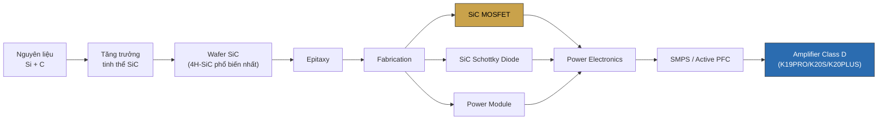
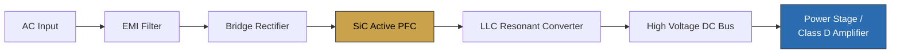

# Silicon Carbide (SiC) trong Power Amplifier — Tài liệu kỹ thuật & Phân tích ứng dụng KORAH

> **Nguồn:** tổng hợp từ `SiC_TECHNOLOGY_MASTER_GUIDE`, `SiC_MANUFACTURERS_DATABASE` (v1.0 và v2.0 — onsemi, Infineon, Wolfspeed, ROHM, STMicroelectronics, Microchip, Mitsubishi Electric, Fuji Electric, GeneSiC, Semikron Danfoss) và tài liệu ứng dụng hãng bán dẫn (EliteSiC™ Technology Overview, CoolSiC™ Technology Overview).
> **Đối chiếu dữ liệu KORAH:** `data/products.js` (bản chính thức, đã duyệt).
> **Nguồn kho tri thức chatbot tương ứng:** `data/knowledge/sic.js`.
>
> **Nguyên tắc biên tập:** Đây là kiến thức NGÀNH SiC nói chung (đa hãng). KORAH trên thực tế **chỉ dùng SiC MOSFET EliteSiC™ của Onsemi (Hoa Kỳ)** cho K19PRO, K20S, K20PLUS. Mọi thông tin về hãng khác (Infineon, Wolfspeed, ROHM...) là kiến thức ngành tham chiếu — phải ghi rõ KHÔNG phải linh kiện KORAH đang dùng, tránh gây hiểu lầm cho khách.

---

## Mục lục

1. [Tổng quan khái niệm](#1-tổng-quan-khái-niệm)
2. [Bảng thông số kỹ thuật — SiC trên K-Series KORAH](#2-bảng-thông-số-kỹ-thuật--sic-trên-k-series-korah)
3. [Bảng so sánh Silicon vs SiC vs GaN](#3-bảng-so-sánh-silicon-vs-sic-vs-gan)
4. [Bảng so sánh các nhà sản xuất SiC (kiến thức ngành)](#4-bảng-so-sánh-các-nhà-sản-xuất-sic-kiến-thức-ngành)
5. [Sơ đồ chuỗi công nghệ SiC (Mermaid)](#5-sơ-đồ-chuỗi-công-nghệ-sic-mermaid)
6. [Sơ đồ vị trí SiC trong mạch nguồn (Mermaid)](#6-sơ-đồ-vị-trí-sic-trong-mạch-nguồn-mermaid)
7. [Sơ đồ chuỗi công nghệ SiC (ASCII)](#7-sơ-đồ-chuỗi-công-nghệ-sic-ascii)
8. [Sơ đồ so sánh cấu trúc tinh thể (ASCII)](#8-sơ-đồ-so-sánh-cấu-trúc-tinh-thể-ascii)
9. [Phân tích & tổng hợp](#9-phân-tích--tổng-hợp)
10. [Nguồn tham khảo](#10-nguồn-tham-khảo)

---

## 1. Tổng quan khái niệm

**Silicon Carbide (SiC)** là hợp chất bán dẫn giữa Silicon (Si) và Carbon (C), thuộc nhóm **Wide Bandgap Semiconductor** (bán dẫn dải cấm rộng — cùng nhóm với GaN). SiC nhân tạo được tổng hợp lần đầu năm 1891; diode SiC thương mại hóa từ 2001; phổ biến mạnh trong EV và điện tử công suất từ khoảng 2015 đến nay.

So với Silicon truyền thống, SiC có bandgap rộng hơn (~3.26 eV so với ~1.12 eV), điện trường đánh thủng cao hơn ~10 lần, chịu nhiệt độ hoạt động cao hơn (200–250°C so với ~150°C), và độ dẫn nhiệt cao hơn ~3 lần. Nhờ đó SiC MOSFET có RDS(on) thấp, chuyển mạch nhanh, tổn hao thấp — phù hợp cho mạch PFC, LLC Resonant và tầng khuếch đại Class D công suất lớn.

Cấu trúc tinh thể phổ biến nhất là **4H-SiC** (ngoài ra còn 3C-SiC, 6H-SiC).

---

## 2. Bảng thông số kỹ thuật — SiC trên K-Series KORAH

*Nguồn: `data/products.js` — chỉ liệt kê dữ liệu đã công bố chính thức.*

| Model | Kênh | Công nghệ bán dẫn | Hãng SiC | Dòng sản phẩm SiC |
|---|:---:|---|---|---|
| K16S | 2 | Silicon (Class D thường) | — | — |
| K16PRO | 4 | Silicon (Class D thường) | — | — |
| K19S | 2 | Silicon (Class D thường) | — | — |
| **K19PRO** | 4 | **Silicon Carbide (SiC)** | Onsemi (Hoa Kỳ) | EliteSiC™ |
| **K20S** | 2 | **Silicon Carbide (SiC)** | Onsemi (Hoa Kỳ) | EliteSiC™ |
| **K20PLUS** | 4 | **Silicon Carbide (SiC)** | Onsemi (Hoa Kỳ) | EliteSiC™ |

**Nhận xét cấu trúc dòng sản phẩm:** SiC đồng thời xuất hiện với PFC nâng cao (Active PFC/PFC Autovolt) trên đúng 3 model cao cấp nhất — không phải ngẫu nhiên (xem phân tích mục 9.2).

---

## 3. Bảng so sánh Silicon vs SiC vs GaN

| Thông số | Silicon (Si) | SiC | GaN |
|---|---|---|---|
| Bandgap | ~1.12 eV | ~3.26 eV | ~3.4 eV (tham khảo ngành) |
| Điện trường đánh thủng | ~0.3 MV/cm | ~3 MV/cm (cao hơn ~10 lần) | Cao |
| Nhiệt độ hoạt động (Junction) | ~150°C | 200–250°C | Cao, nhưng thường hạn chế bởi đóng gói |
| Độ dẫn nhiệt | ~150 W/m·K | ~490 W/m·K (cao hơn ~3 lần) | Trung bình |
| Chi phí | Thấp | Cao hơn Si | Cao |
| Tối ưu cho | Ứng dụng phổ thông, chi phí thấp | Công suất lớn, điện áp cao | Tần số chuyển mạch rất cao |
| **KORAH sử dụng cho** | K16S, K16PRO, K19S | **K19PRO, K20S, K20PLUS** | Không dùng |

---

## 4. Bảng so sánh các nhà sản xuất SiC (kiến thức ngành)

*Lưu ý: bảng này là kiến thức ngành SiC nói chung — KORAH chỉ dùng dòng in đậm bên dưới.*

| Hãng | Quốc gia | Dòng SiC | Điện áp phổ biến | Ứng dụng nổi bật |
|---|---|---|---|---|
| **onsemi** | **Hoa Kỳ** | **EliteSiC™** | **650/750/1200/1700V** | **EV, SMPS, UPS, Audio ← KORAH dùng dòng này** |
| Infineon | Đức | CoolSiC™ | 650/750/1200/2000V | EV, Công nghiệp |
| Wolfspeed | Hoa Kỳ | C2M/C3M | 650/1200/1700V | EV, Solar |
| ROHM | Nhật Bản | Gen4 SiC | 650/1200/1700V | Ô tô, Công nghiệp |
| STMicroelectronics | Châu Âu | STPOWER SiC | 650/1200V | EV |
| Microchip | Hoa Kỳ | SiC Portfolio | 700/1200/1700V | Công nghiệp |
| Mitsubishi Electric | Nhật Bản | Full-SiC | 1200/1700V | Đường sắt, Inverter |
| Fuji Electric | Nhật Bản | All-SiC | 1200/1700V | Biến tần |
| GeneSiC | Hoa Kỳ | GeneSiC | 650–3300V | Hàng không, Quốc phòng |
| Semikron Danfoss | Đức | SEMITRANS SiC | 1200/1700V | Module công suất (không có MOSFET/Diode rời) |

---

## 5. Sơ đồ chuỗi công nghệ SiC (Mermaid)



---

## 6. Sơ đồ vị trí SiC trong mạch nguồn (Mermaid)



---

## 7. Sơ đồ chuỗi công nghệ SiC (ASCII)

```
   SiC Crystal
        │
        ▼
   SiC Wafer  (4H-SiC phổ biến nhất; 3C-SiC, 6H-SiC ít phổ biến hơn)
        │
        ▼
    Epitaxy
        │
        ▼
┌───────┴────────┐
▼                ▼
MOSFET         Diode  (Schottky, reverse recovery rất thấp)
│                │
└───────┬────────┘
        ▼
  Power Module
        │
        ▼
   SMPS / PFC
        │
        ▼
Amplifier Class D / EV / UPS
   (KORAH: K19PRO, K20S, K20PLUS)
```

---

## 8. Sơ đồ so sánh cấu trúc tinh thể (ASCII)

```
  Silicon (Si)                    Silicon Carbide (4H-SiC)
  ┌─────────────────┐             ┌─────────────────┐
  │  Bandgap: 1.12eV  │             │  Bandgap: 3.26eV  │
  │  ○───○───○───○    │             │  ○─C─○─C─○─C─○    │
  │  │   │   │   │    │   ─────▶   │  Si  Si  Si  Si   │
  │  ○───○───○───○    │  Wide     │  (xen kẽ Si + C,   │
  │  (chỉ nguyên tử Si) │  Bandgap  │   liên kết bền hơn) │
  └─────────────────┘             └─────────────────┘
   Chịu áp thấp                    Chịu áp cao (~10x)
   Chịu nhiệt ~150°C                Chịu nhiệt 200–250°C
   Tổn hao chuyển mạch cao          Tổn hao chuyển mạch thấp
```

---

## 9. Phân tích & tổng hợp

### 9.1 Vì sao SiC phù hợp cho power amplifier công suất lớn

SiC MOSFET có RDS(on) thấp (giảm tổn hao dẫn khi có dòng chạy qua) và tốc độ chuyển mạch nhanh với tổn hao chuyển mạch thấp — 2 đặc tính then chốt cho mạch PFC và tầng khuếch đại Class D vận hành liên tục ở công suất lớn. Nhiệt độ Junction chịu được đến 200–250°C (so với ~150°C của Silicon) giúp linh kiện hoạt động bền bỉ hơn khi amplifier chạy sự kiện nhiều giờ liên tục — đúng đặc thù ngành pro-audio.

### 9.2 Liên hệ SiC ↔ PFC trong thiết kế KORAH

Đối chiếu Bảng 2: cả 3 model dùng SiC (K19PRO, K20S, K20PLUS) đều là các model có PFC nâng cao nhất dòng (K19PRO dùng PFC Autovolt 140V–270V; K20S/K20PLUS dùng PFC tối ưu hiệu suất). Đây là lựa chọn thiết kế nhất quán, không phải ngẫu nhiên: theo tài liệu `docs/technical/pfc-active-pfc-technical-analysis.md` mục 8.1, tầng PFC công suất lớn cần linh kiện chuyển mạch tổn hao thấp/chịu nhiệt tốt — SiC MOSFET đáp ứng đúng yêu cầu này, đặc biệt khi PFC vận hành ở chế độ CCM công suất lớn (kiến thức ngành — KORAH chưa công bố chế độ dẫn dòng cụ thể).

### 9.3 Vị thế cạnh tranh trong ngành

So với các hãng SiC lớn khác (Bảng 4), Onsemi EliteSiC™ và Infineon CoolSiC™ là 2 dòng dẫn đầu về hệ sinh thái đầy đủ (MOSFET + Schottky Diode + Power Module + Driver hỗ trợ), cùng phân khúc ứng dụng (EV, SMPS, UPS, Audio). Việc KORAH chọn Onsemi EliteSiC™ đặt các model cao cấp của mình vào cùng nhóm công nghệ với các ứng dụng công suất lớn hàng đầu ngành (EV, AI Data Center, Industrial Drive) — không phải công nghệ "riêng lẻ" cho ngành âm thanh mà là công nghệ dùng chung với các ngành công nghiệp yêu cầu độ tin cậy cao nhất.

### 9.4 Giới hạn cần lưu ý khi truyền thông

- Chỉ khẳng định KORAH dùng **Onsemi EliteSiC™** — không suy diễn thông số cụ thể (dòng điện định mức, RDS(on) chính xác, mã part number) nếu tài liệu chính thức chưa công bố.
- Khi nhắc đến hãng khác (Infineon, Wolfspeed...) trong nội dung marketing/FAQ, **luôn ghi rõ đây là kiến thức ngành tham chiếu, không phải linh kiện KORAH đang dùng** — tránh khách hiểu nhầm KORAH dùng đa hãng.
- Với nội dung khách hàng cuối: "dịch" thuật ngữ (RDS(on), Junction Temperature, 4H-SiC...) thành lợi ích thực tế ("chịu nhiệt tốt hơn, bền hơn khi chạy công suất lớn liên tục") — thuật ngữ hàn lâm chỉ dùng trong tài liệu kỹ thuật chuyên sâu như tài liệu này.

---

## 10. Nguồn tham khảo

- `SiC_TECHNOLOGY_MASTER_GUIDE.md` (v1.0).
- `SiC_MANUFACTURERS_DATABASE.md` (v1.0) và `SiC_MANUFACTURERS_DATABASE_v2.0*.md` (Tổng quan thị trường, onsemi, Infineon, Bảng so sánh, Bảng so sánh mở rộng, Danh mục tài liệu tham khảo).
- Tài liệu ứng dụng: EliteSiC™ Technology Overview & MOSFET Portfolio Guide (onsemi), CoolSiC™ Technology Overview (Infineon).
- Dữ liệu chính thức KORAH: `data/products.js` (đã duyệt).

*Tổng hợp và diễn giải lại bằng tiếng Việt cho mục đích nội bộ KORAH — không sao chép nguyên văn từ nguồn.*
